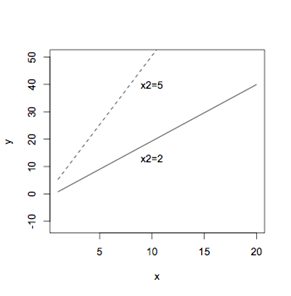

```{r, echo = FALSE, results = "hide"}
include_supplement("UvA20091102-20-1.png", recursive = TRUE)
```
Question
========

Er wordt een regressie gedaan met twee onafhankelijke variabelen x1 en x2 die samen de afhankelijke variabele y moeten verklaren. Om de regressie weer te geven in een figuur, wordt voor een aantal waarden van x2 de regressie met alleen x1 steeds opnieuw uitgerekend en in de figuur gezet. In deze figuur staan twee van die aparte regressielijnen met de waarden voor x2 van 2 en 5: Welke assumptie van multipele regressie voor het toetsen op co?ffici?nten wordt hier waarschijnlijk geschonden? 

  

Answerlist
----------
* Er is een lineaire relatie tussen y en ieder van de onafhankelijke variabelen.
* De richtingsco\u00ebffici\u00ebnt is hetzelfde voor alle combinaties van andere onafhankelijke variabelen.
* De populatie standaarddeviatie is hetzelfde voor alle combinaties van onafhankelijke variabelen.

Solution
========

The correct answer is  De richtingsco\u00ebffici\u00ebnt is hetzelfde voor alle combinaties van andere onafhankelijke variabelen. 

Meta-information
================
exname: uva-descriptive statistics-124-nl.Rmd 
extype: schoice 
exsolution: 010 
exsection: Inferential Statistics/Regression/Intercept
exextra[Type]: Calculation, Case, Conceptual, Creating graphs, Data manipulation, Interpretating graph, Interpretating output, Performing analysis, Test choice 
exextra[Langauge]: Dutch 
exextra[Level]: Statistical Literacy, Statistical Reasoning, Statistical Thinking 
