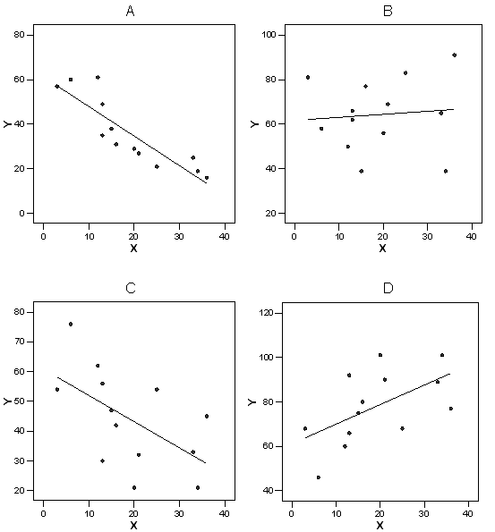

```{r, echo = FALSE, results = "hide"}
include_supplement("item_file_id19_UMCU20050611-5.png", recursive = TRUE)
```
Question
========

Hieronder staan 4 spreidingsdiagrammen (genaamd A, B, C en D) van X en Y. In welk van de 4 spreidingsdiagrammen is de vergelijking van de regressievergelijking gelijk aan Y = 61 + 0.88 X? 


 

Answerlist
----------
* A
* B
* C
* D

Solution
========

The correct answer is  D 

Meta-information
================
exname: uva-descriptive statistics-288-nl.Rmd 
extype: schoice 
exsolution: 0001 
exsection: Inferential Statistics/Regression/Equation
exextra[Type]: Calculation, Case, Conceptual, Creating graphs, Data manipulation, Interpretating graph, Interpretating output, Performing analysis, Test choice 
exextra[Langauge]: Dutch 
exextra[Level]: Statistical Literacy, Statistical Reasoning, Statistical Thinking 
