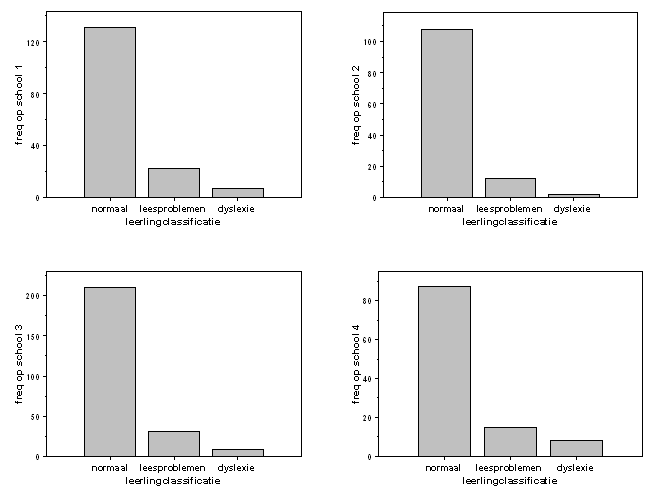

```{r, echo = FALSE, results = "hide"}
include_supplement("item_file_id24_UMCU20040306-1.png", recursive = TRUE)
```
Question
========

Op vier scholen worden de leerlingen in groepen 3, 4 en 5 in één van 3 klassen ingedeeld voor wat betreft hun leesvaardigheid: normaal, leesproblemen, dyslexie. De aantallen leerlingen in iedere klasse staan in de volgende 4 staafdiagrammen weergegeven. De variabele "leerlingclassificatie" wordt gemeten op




Answerlist
----------
* nominaal meetniveau
* ordinaal meetniveau
* interval meetniveau
* ratio meetniveau

Solution
========

The correct answer is  ordinaal meetniveau

Meta-information
================
exname: uva-descriptive statistics-293-nl.Rmd
extype: schoice
exsolution: 0100
exsection: Measurement Level/Ordinal
exextra[Type]: Calculation, Case, Conceptual, Creating graphs, Data manipulation, Interpretating graph, Interpretating output, Performing analysis, Test choice
exextra[Langauge]: Dutch
exextra[Level]: Statistical Literacy, Statistical Reasoning, Statistical Thinking
