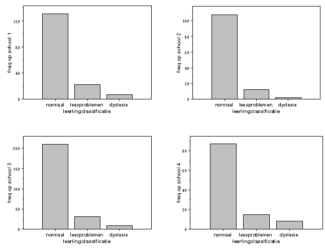

```{r, echo = FALSE, results = "hide"}
include_supplement("item_file_id24_UMCU20040306-1.png", recursive = TRUE)
```
Question
========

Op vier scholen worden de leerlingen in groepen 3, 4 en 5 in ??n van 3 klassen ingedeeld voor wat betreft hun leesvaardigheid: normaal, leesproblemen, dyslexie. De aantallen leerlingen in iedere klasse staan in de volgende 4 staafdiagrammen weergegeven. Dyslexie komt relatief het vaakst voor op school 

  

Answerlist
----------
* 1
* 2
* 3
* 4

Solution
========

The correct answer is  4 

Meta-information
================
exname: uva-descriptive statistics-294-nl.Rmd 
extype: schoice 
exsolution: 0001 
exsection: Descriptive statistics/Data representation/Graphs/Bar graph
exextra[Type]: Calculation, Case, Conceptual, Creating graphs, Data manipulation, Interpretating graph, Interpretating output, Performing analysis, Test choice 
exextra[Langauge]: Dutch 
exextra[Level]: Statistical Literacy, Statistical Reasoning, Statistical Thinking 
