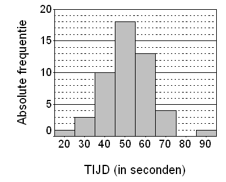

```{r, echo = FALSE, results = "hide"}
include_supplement("UMCU20040515-7.png", recursive = TRUE)
```
Question
========

In een beschrijvend onderzoek is bij 50 pati?nten met ademhalingsmoeilijkheden gekeken naar het aantal seconden dat zij de adem in kunnen houden. De resultaten staan in het onderstaande histogram weergegeven. Het percentage mensen dat de adem meer dan 55 seconden kan inhouden is in deze steekproef gelijk aan 

 

 

Answerlist
----------
* 10%
* 18%
* 26%
* 36%

Solution
========

The correct answer is  36% 

Meta-information
================
exname: uva-descriptive statistics-319-nl.Rmd 
extype: schoice 
exsolution: 0001 
exsection: Descriptive statistics/Data representation/Graphs/Bar graph
exextra[Type]: Calculation, Case, Conceptual, Creating graphs, Data manipulation, Interpretating graph, Interpretating output, Performing analysis, Test choice 
exextra[Langauge]: Dutch 
exextra[Level]: Statistical Literacy, Statistical Reasoning, Statistical Thinking 
