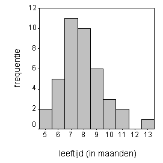

```{r, echo = FALSE, results = "hide"}
include_supplement("item_file_id38_UMCU20030308-1.png", recursive = TRUE)
```
Question
========

In nevenstaande grafiek staat van 40 baby?s de leeftijd (in maanden) waarop hun eerste tand doorbrak. De variabele "leeftijd" is 


  

Answerlist
----------
* kwantitatief, op intervalschaal
* kwalitatief, op ordinale schaal
* kwantitatief, op ratioschaal
* kwalitatief, op intervalschaal

Solution
========

The correct answer is  kwantitatief, op ratioschaal 

Meta-information
================
exname: uva-descriptive statistics-333-nl.Rmd 
extype: schoice 
exsolution: 001 
exsection: Measurement Level/Interval
exextra[Type]: Calculation, Case, Conceptual, Creating graphs, Data manipulation, Interpretating graph, Interpretating output, Performing analysis, Test choice 
exextra[Langauge]: Dutch 
exextra[Level]: Statistical Literacy, Statistical Reasoning, Statistical Thinking 
