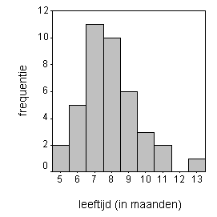

```{r, echo = FALSE, results = "hide"}
include_supplement("item_file_id38_UMCU20030308-1.png", recursive = TRUE)
```
Question
========

In nevenstaande grafiek staat van 40 baby?s de leeftijd (in maanden) waarop hun eerste tand doorbrak. Welke van de onderstaande beweringen omtrent mediaan en gemiddelde is juist?



Answerlist
----------
* mediaan is kleiner dan gemiddelde
* mediaan en gemiddelde zijn gelijk
* mediaan is groter dan gemiddelde
* mediaan en gemiddelde zijn hier niet te vergelijken

Solution
========

The correct answer is  mediaan is kleiner dan gemiddelde

Meta-information
================
exname: uva-descriptive statistics-334-nl.Rmd
extype: schoice
exsolution: 1000
exsection: Descriptive statistics/Summary Statistics/Measures of Location
exextra[Type]: Calculation, Case, Conceptual, Creating graphs, Data manipulation, Interpretating graph, Interpretating output, Performing analysis, Test choice
exextra[Langauge]: Dutch
exextra[Level]: Statistical Literacy, Statistical Reasoning, Statistical Thinking
