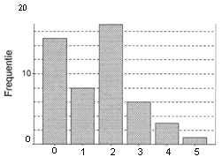

```{r, echo = FALSE, results = "hide"}
include_supplement("UMCU20030426-1.png", recursive = TRUE)
```
Question
========

In onderstaande grafiek staat van 50 gezinnen hoeveel kinderen ze bevatten. Het percentage gezinnen met 3 of meer kinderen is gelijk aan 


  

Answerlist
----------
* 8
* 10
* 12
* 20

Solution
========

The correct answer is  20 

Meta-information
================
exname: uva-descriptive statistics-343-nl.Rmd 
extype: schoice 
exsolution: 0001 
exsection: Descriptive statistics/Data representation/Graphs/Bar graph
exextra[Type]: Calculation, Case, Conceptual, Creating graphs, Data manipulation, Interpretating graph, Interpretating output, Performing analysis, Test choice 
exextra[Langauge]: Dutch 
exextra[Level]: Statistical Literacy, Statistical Reasoning, Statistical Thinking 
