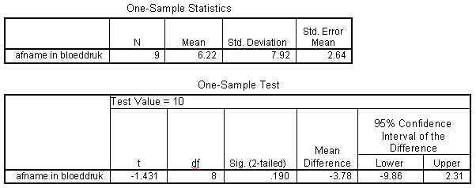

```{r, echo = FALSE, results = "hide"}
include_supplement("item_file_id40_UMCU20030426-9.png", recursive = TRUE)
```
Question
========

Hieronder staat SPSS-uitvoer van een steekproef T toets betreffende afname in bloeddruk na medicatie. Het 95% tweezijdig betrouwbaarheidsinterval voor ? is gelijk aan 

 

Answerlist
----------
* (- 12.04 ; 24.48)
* (- 9.86 ; 2.31)
* (0.14; 12.31 )
* (0.24; 12.19)

Solution
========

The correct answer is  (0.14; 12.31 ) 

Meta-information
================
exname: uva-descriptive statistics-351-nl.Rmd 
extype: schoice 
exsolution: 001 
exsection: Descriptive statistics/Summary Statistics/Measures of Location
exextra[Type]: Calculation, Case, Conceptual, Creating graphs, Data manipulation, Interpretating graph, Interpretating output, Performing analysis, Test choice 
exextra[Langauge]: Dutch 
exextra[Level]: Statistical Literacy, Statistical Reasoning, Statistical Thinking 
