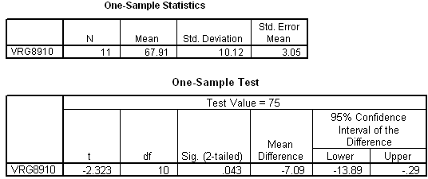

```{r, echo = FALSE, results = "hide"}
include_supplement("item_file_id46_UMCU20020406-8.png", recursive = TRUE)
```
Question
========

Hieronder staat uitvoer van een ??n-steekproef T-toets. We willen H0:? = 75 toetsen met a = 5% tweezijdig. Het 95% betrouwbaarheidsinterval voor ? is gelijk aan 


  

Answerlist
----------
* &lt; -13.89 ; -0.29 &gt;
* &lt; 61.11 ; 74.71 &gt;
* &lt; 61.11 ; 75.29 &gt;
* &lt; 75.29 ; 88.89 &gt;

Solution
========

The correct answer is  &lt; 61.11 ; 74.71 &gt; 

Meta-information
================
exname: uva-descriptive statistics-390-nl.Rmd 
extype: schoice 
exsolution: 010 
exsection: Descriptive statistics/Summary Statistics/Measures of Location
exextra[Type]: Calculation, Case, Conceptual, Creating graphs, Data manipulation, Interpretating graph, Interpretating output, Performing analysis, Test choice 
exextra[Langauge]: Dutch 
exextra[Level]: Statistical Literacy, Statistical Reasoning, Statistical Thinking 
