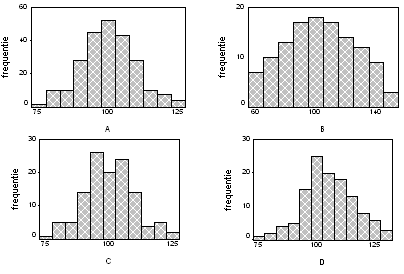

```{r, echo = FALSE, results = "hide"}
include_supplement("UMCU19990220-4.png", recursive = TRUE)
```
Question
========

Van 120 getallen is het gemiddelde 100 en de standaardafwijking 10. Welk van de volgende vier histogrammen komt hiermee overeen. 

 

  

Answerlist
----------
* A
* B
* C
* D

Solution
========

The correct answer is  C 

Meta-information
================
exname: uva-descriptive statistics-472-nl.Rmd 
extype: schoice 
exsolution: 001 
exsection: Descriptive statistics/Data representation/Graphs/Histogram
exextra[Type]: Calculation, Case, Conceptual, Creating graphs, Data manipulation, Interpretating graph, Interpretating output, Performing analysis, Test choice 
exextra[Langauge]: Dutch 
exextra[Level]: Statistical Literacy, Statistical Reasoning, Statistical Thinking 
