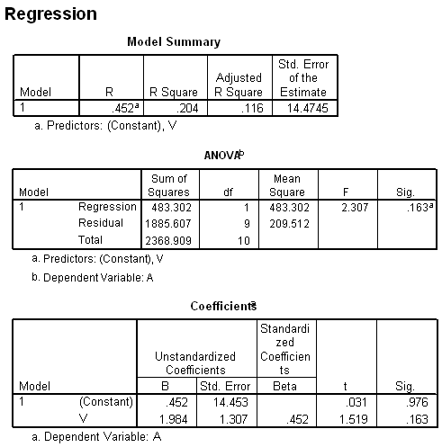

```{r, echo = FALSE, results = "hide"}
include_supplement("item_file_id63_UMCU19990612-9.png", recursive = TRUE)
```
Question
========

De vergelijking van de regressievergelijking luidt 




Answerlist
----------
* A = 0.452 + 1.984 x V
* A = 1.984 + 0.452 x V
* V = 0.452 + 1.984 x A
* V = 1.984 + 0.452 x V

Solution
========

The correct answer is  A = 0.452 + 1.984 x V 

Meta-information
================
exname: uva-descriptive statistics-507-nl.Rmd 
extype: schoice 
exsolution: 100 
exsection: Inferential Statistics/Regression/R squared
exextra[Type]: Calculation, Case, Conceptual, Creating graphs, Data manipulation, Interpretating graph, Interpretating output, Performing analysis, Test choice 
exextra[Langauge]: Dutch 
exextra[Level]: Statistical Literacy, Statistical Reasoning, Statistical Thinking 
