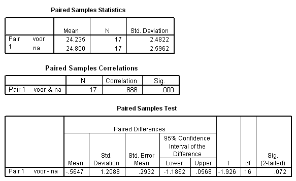

```{r, echo = FALSE, results = "hide"}
include_supplement("item_file_id12_UMCU20050416-17.png", recursive = TRUE)
```
Question
========

De Standard Error of the Mean (SEM) van de voor-metingen is gelijk aan




Answerlist
----------
* 0.362
* 0.602
* 0.621
* 0.63

Solution
========

The correct answer is  0.602

Meta-information
================
exname: uva-inferential statistics-269-nl.Rmd
extype: schoice
exsolution: 010
exsection: Inferential Statistics/Parametric Techniques/t-test/Paired samples
exextra[Type]: Calculation, Case, Conceptual, Creating graphs, Data manipulation, Interpretating graph, Interpretating output, Performing analysis, Test choice
exextra[Langauge]: Dutch
exextra[Level]: Statistical Literacy, Statistical Reasoning, Statistical Thinking
