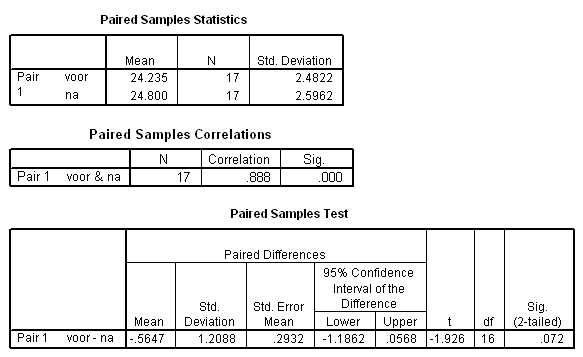

```{r, echo = FALSE, results = "hide"}
include_supplement("item_file_id12_UMCU20050416-17.png", recursive = TRUE)
```
Question
========

In de gepaarde T-toets wordt de nulhypothese H0: ?D = ?voor - ?na = 0 getoetst. Bij een tweezijdig risico van a = 0.05 moet de conclusie luiden: 




Answerlist
----------
* De gevonden T-waarde ligt in het kritiek gebied, verwerp H<sub>0<\/sub>.
* De gevonden T-waarde ligt niet in het kritiek gebied, verwerp H<sub>0<\/sub>.
* De gevonden T-waarde ligt in het kritiek gebied, verwerp H<sub>0<\/sub> niet.
* De gevonden T-waarde ligt niet in het kritiek gebied, verwerp H<sub>0<\/sub> niet.

Solution
========

The correct answer is  De gevonden T-waarde ligt niet in het kritiek gebied, verwerp H<sub>0<\/sub> niet. 

Meta-information
================
exname: uva-inferential statistics-270-nl.Rmd 
extype: schoice 
exsolution: 0001 
exsection: Inferential Statistics/Parametric Techniques/t-test/Paired samples
exextra[Type]: Calculation, Case, Conceptual, Creating graphs, Data manipulation, Interpretating graph, Interpretating output, Performing analysis, Test choice 
exextra[Langauge]: Dutch 
exextra[Level]: Statistical Literacy, Statistical Reasoning, Statistical Thinking 
