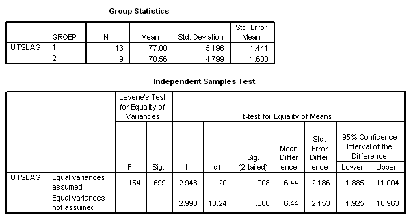

```{r, echo = FALSE, results = "hide"}
include_supplement("item_file_id15_UMCU20050514-6.png", recursive = TRUE)
```
Question
========

Wanneer we hier een F-toets voor gelijkheid van varianties zouden uitvoeren, dan zou de waarde van de toetsingsgrootheid gelijk zijn aan




Answerlist
----------
* 1.08
* 1.11
* 1.17
* 1.23

Solution
========

The correct answer is  1.17

Meta-information
================
exname: uva-inferential statistics-278-nl.Rmd
extype: schoice
exsolution: 001
exsection: Distributions/Continuous/F-distribution
exextra[Type]: Calculation, Case, Conceptual, Creating graphs, Data manipulation, Interpretating graph, Interpretating output, Performing analysis, Test choice
exextra[Langauge]: Dutch
exextra[Level]: Statistical Literacy, Statistical Reasoning, Statistical Thinking
