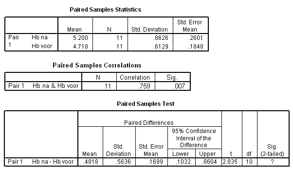

```{r, echo = FALSE, results = "hide"}
include_supplement("item_file_id20_UMCU20050611-7.png", recursive = TRUE)
```
Question
========

Elf personen volgen een dieet om hun hemoglobine-gehalte te verhogen. Hieronder staat SPSS-uitvoer van een toets om te kijken of het Hb-gehalte voor en na het dieet inderdaad anders is. Hoeveel van de variatie in de nametingen hangt samen met de variatie in de voormetingen? 


 

Answerlist
----------
* 75.9%
* 57.6%
* 56.4%
* 48.18%

Solution
========

The correct answer is  57.6% 

Meta-information
================
exname: uva-inferential statistics-290-nl.Rmd 
extype: schoice 
exsolution: 010 
exsection: Inferential Statistics/Parametric Techniques/t-test/Paired samples
exextra[Type]: Calculation, Case, Conceptual, Creating graphs, Data manipulation, Interpretating graph, Interpretating output, Performing analysis, Test choice 
exextra[Langauge]: Dutch 
exextra[Level]: Statistical Literacy, Statistical Reasoning, Statistical Thinking 
