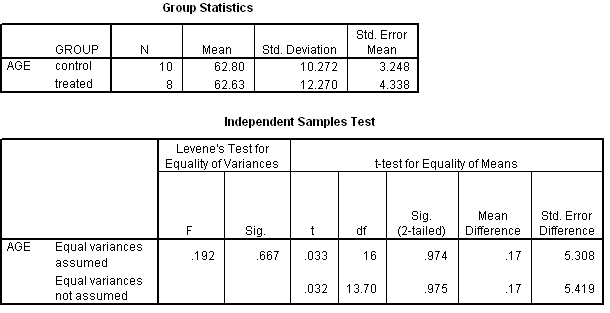

```{r, echo = FALSE, results = "hide"}
include_supplement("item_file_id26_UMCU20040417-9.png", recursive = TRUE)
```
Question
========

Voor een experiment over de effectiviteit van een hulpprogramma voor zelfredzaamheid bij ouderen worden mensen aselect in een controle- of behandelde groep ingedeeld. In onderstaande SPSS uitvoer staat een toets op gelijkheid van gemiddelde leeftijd. De gepoolde variantieschatter is gelijk aan



Answerlist
----------
* 124.24
* 125.22
* 125.53
* 128.03

Solution
========

The correct answer is  125.22

Meta-information
================
exname: uva-inferential statistics-311-nl.Rmd
extype: schoice
exsolution: 010
exsection: Inferential Statistics/Parametric Techniques/t-test/Independent samples means
exextra[Type]: Calculation, Case, Conceptual, Creating graphs, Data manipulation, Interpretating graph, Interpretating output, Performing analysis, Test choice
exextra[Langauge]: Dutch
exextra[Level]: Statistical Literacy, Statistical Reasoning, Statistical Thinking
