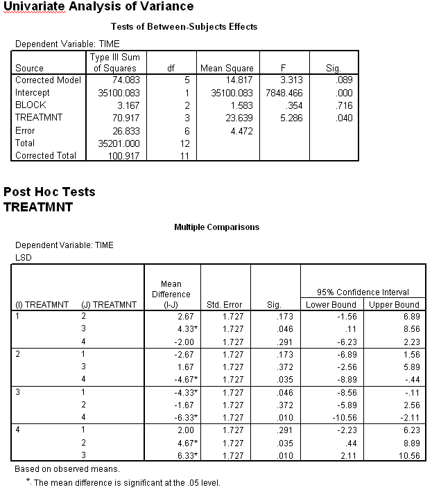

```{r, echo = FALSE, results = "hide"}
include_supplement("item_file_id28_UMCU20040515-5.png", recursive = TRUE)
```
Question
========

Hieronder staat SPSS-uitvoer van een Randomised Complete Block ANOVA met TIME als afhankelijke variabele, TREATMNT als behandelvariabele en BLOCK als blokvariabele. Bij het toetsen of er een behandeleffect is (met een tweezijdig risico van 5%) moet de redenering plus conclusie luiden: 


 

Answerlist
----------
* Een significant effect want de steekproefgemiddelden zijn ongelijk.
* Geen significant effect want de p-waarde is groter dan 0.05.
* Een significant effect want de p-waarde is kleiner dan 0.05.
* Dit kan niet getoetst worden, omdat er niet gerandomiseerd is <em>over<\/em> de blokken, maar <em>erbinnen<\/em>.

Solution
========

The correct answer is  Een significant effect want de p-waarde is kleiner dan 0.05. 

Meta-information
================
exname: uva-inferential statistics-317-nl.Rmd 
extype: schoice 
exsolution: 001 
exsection: Inferential Statistics/Parametric Techniques/ANOVA/Oneway ANOVA
exextra[Type]: Calculation, Case, Conceptual, Creating graphs, Data manipulation, Interpretating graph, Interpretating output, Performing analysis, Test choice 
exextra[Langauge]: Dutch 
exextra[Level]: Statistical Literacy, Statistical Reasoning, Statistical Thinking 
