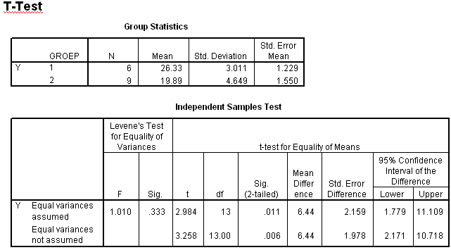

```{r, echo = FALSE, results = "hide"}
include_supplement("item_file_id30_UMCU20040515-8.png", recursive = TRUE)
```
Question
========

Bij het toetsen van H0: ?1 = ?2 tegen H1: ?1 <U+2260> ?2 met 5% risico moet de conclusie luiden: 


 

Answerlist
----------
* Het toetsresultaat is significant, verwerp H<sub>0<\/sub>.
* Het toetsresultaat is significant, verwerp H<sub>0<\/sub> niet.
* Het toetsresultaat is niet significant, verwerp H<sub>0<\/sub>.
* Het toetsresultaat is niet significant, verwerp H<sub>0<\/sub> niet.

Solution
========

The correct answer is  Het toetsresultaat is significant, verwerp H<sub>0<\/sub>. 

Meta-information
================
exname: uva-inferential statistics-321-nl.Rmd 
extype: schoice 
exsolution: 100 
exsection: Inferential Statistics/Parametric Techniques/t-test/Independent samples means
exextra[Type]: Calculation, Case, Conceptual, Creating graphs, Data manipulation, Interpretating graph, Interpretating output, Performing analysis, Test choice 
exextra[Langauge]: Dutch 
exextra[Level]: Statistical Literacy, Statistical Reasoning, Statistical Thinking 
