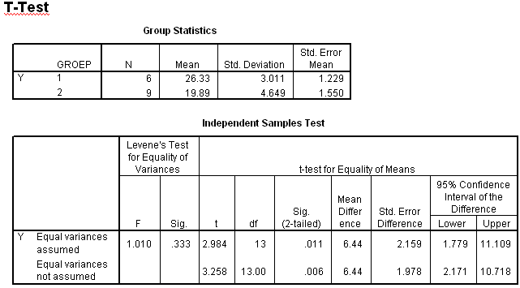

```{r, echo = FALSE, results = "hide"}
include_supplement("item_file_id30_UMCU20040515-8.png", recursive = TRUE)
```
Question
========

Hieronder staan twee uitspraken. Welke hiervan zijn juist?
I: H0: ?1 - ?2 = 5 moet worden verworpen (bij a = 5% tweezijdig)
II: H0: ?1 - ?2 = -2 moet worden verworpen (bij a = 5% tweezijdig) 


  

Answerlist
----------
* Beide uitspraak zijn juist.
* Uitspraak I is juist, uitspraak II is onjuist.
* Uitspraak I is onjuist, uitspraak II is juist.
* Beide uitspraak zijn onjuist.

Solution
========

The correct answer is  Uitspraak I is onjuist, uitspraak II is juist. 

Meta-information
================
exname: uva-inferential statistics-322-nl.Rmd 
extype: schoice 
exsolution: 001 
exsection: Inferential Statistics/Parametric Techniques/t-test/Independent samples means
exextra[Type]: Calculation, Case, Conceptual, Creating graphs, Data manipulation, Interpretating graph, Interpretating output, Performing analysis, Test choice 
exextra[Langauge]: Dutch 
exextra[Level]: Statistical Literacy, Statistical Reasoning, Statistical Thinking 
