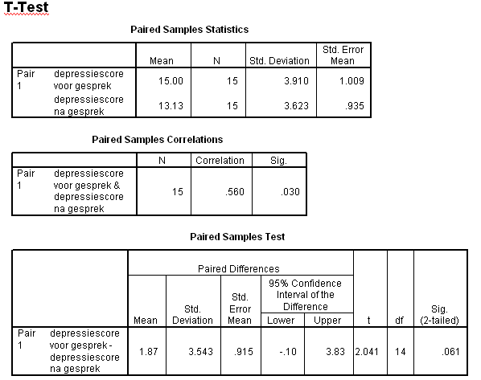

```{r, echo = FALSE, results = "hide"}
include_supplement("item_file_id35_UMCU20040612-9.png", recursive = TRUE)
```
Question
========

Hieronder staat SPSS-uitvoer van een gepaarde T-toets op depressiescores van 15 pati?nten, gemeten voor en na een gesprek met een therapeut. Hieronder staan twee uitspraken. Welke hiervan zijn juist?
I: H0: ?voor ? ?na = 0 moet worden verworpen (bij a=5% tweezijdig).
II: var(Xgemiddeld voor - Xgemiddeld na) = var(Xgemiddeld voor) + var(Xgemiddeld na) 


  

Answerlist
----------
* Beide uitspraken zijn juist.
* Uitspraak I is juist, uitspraak II is onjuist.
* Uitspraak I is onjuist, uitspraak II is juist.
* Beide uitspraken zijn onjuist.

Solution
========

The correct answer is  Beide uitspraken zijn onjuist. 

Meta-information
================
exname: uva-inferential statistics-332-nl.Rmd 
extype: schoice 
exsolution: 0001 
exsection: Inferential Statistics/Parametric Techniques/t-test/Paired samples
exextra[Type]: Calculation, Case, Conceptual, Creating graphs, Data manipulation, Interpretating graph, Interpretating output, Performing analysis, Test choice 
exextra[Langauge]: Dutch 
exextra[Level]: Statistical Literacy, Statistical Reasoning, Statistical Thinking 
