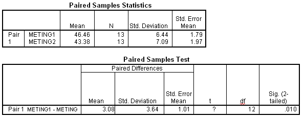

```{r, echo = FALSE, results = "hide"}
include_supplement("item_file_id42_UMCU20030517-3.png", recursive = TRUE)
```
Question
========

Hieronder staat SPSS-uitvoer van een gepaarde T toets, met H0: ?meting 1 = ?meting 2. De waarde van de toetsingsgrootheid t (het vraagteken in de uitvoer) is gelijk aan 


 

Answerlist
----------
* 1.1
* 1.16
* 1.21
* 3.05

Solution
========

The correct answer is  3.05 

Meta-information
================
exname: uva-inferential statistics-354-nl.Rmd 
extype: schoice 
exsolution: 0001 
exsection: Inferential Statistics/Parametric Techniques/t-test/Paired samples
exextra[Type]: Calculation, Case, Conceptual, Creating graphs, Data manipulation, Interpretating graph, Interpretating output, Performing analysis, Test choice 
exextra[Langauge]: Dutch 
exextra[Level]: Statistical Literacy, Statistical Reasoning, Statistical Thinking 
