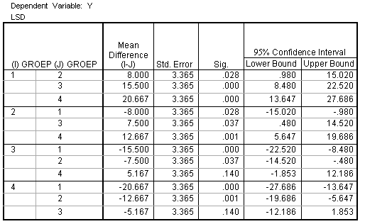

```{r, echo = FALSE, results = "hide"}
include_supplement("item_file_id44_UMCU20030517-9.png", recursive = TRUE)
```
Question
========

Een CRD-ANOVA die toetste of de populatiegemiddelden van 4 groepen gelijk waren bleek significant te zijn. Hieronder staat SPSS-uitvoer van de Fisher's LSD multiple comparisons post hoc tests die uitgevoerd zijn om te bepalen welke groepen van elkaar verschillen. Welke groepen zijn onderling significant verschillend op 5% niveau? 


  

Answerlist
----------
* 2-4
* 1-2, 1-3, 1-4, 2-3 en 2-4
* 1-3, 1-4 en 2-4
* allemaal

Solution
========

The correct answer is  1-3, 1-4 en 2-4 

Meta-information
================
exname: uva-inferential statistics-360-nl.Rmd 
extype: schoice 
exsolution: 001 
exsection: Inferential Statistics/Parametric Techniques/ANOVA/Oneway ANOVA
exextra[Type]: Calculation, Case, Conceptual, Creating graphs, Data manipulation, Interpretating graph, Interpretating output, Performing analysis, Test choice 
exextra[Langauge]: Dutch 
exextra[Level]: Statistical Literacy, Statistical Reasoning, Statistical Thinking 
