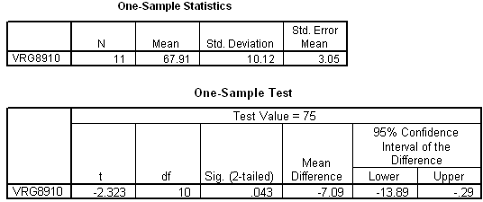

```{r, echo = FALSE, results = "hide"}
include_supplement("item_file_id46_UMCU20020406-8.png", recursive = TRUE)
```
Question
========

Hieronder staat uitvoer van een ??n-steekproef T-toets. We willen H0:? = 75 toetsen met a = 5% tweezijdig. Wanneer we bij toetsing gebruik hadden willen maken van een kritiek gebied, dan was de rechter kritieke waarde gelijk geweest aan 


  

Answerlist
----------
* 1.7959
* 1.8125
* 2.201
* 2.2281

Solution
========

The correct answer is  2.2281 

Meta-information
================
exname: uva-inferential statistics-391-nl.Rmd 
extype: schoice 
exsolution: 0001 
exsection: Inferential Statistics/Parametric Techniques/t-test/One sample mean
exextra[Type]: Calculation, Case, Conceptual, Creating graphs, Data manipulation, Interpretating graph, Interpretating output, Performing analysis, Test choice 
exextra[Langauge]: Dutch 
exextra[Level]: Statistical Literacy, Statistical Reasoning, Statistical Thinking 
