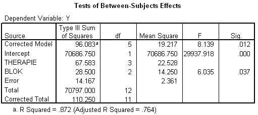

```{r, echo = FALSE, results = "hide"}
include_supplement("item_file_id50_UMCU20020511-8.png", recursive = TRUE)
```
Question
========

Hieronder staat (onvolledige) SPSS-uitvoer van een RCB-ANOVA, waarbij binnen de blokken individuen aselect zijn toegewezen aan een therapie. De conclusie omtrent de blokfactor moet luiden:



Answerlist
----------
* De blokgemiddelden zijn significant verschillend.
* De blokgemiddelden zijn significant gelijk.
* De blokgemiddelden zijn niet significant verschillend.
* De hypothese over blokgemiddelden kan niet getoetst worden.

Solution
========

The correct answer is  De hypothese over blokgemiddelden kan niet getoetst worden.

Meta-information
================
exname: uva-inferential statistics-400-nl.Rmd
extype: schoice
exsolution: 0001
exsection: Inferential Statistics/Parametric Techniques/ANOVA/Oneway ANOVA
exextra[Type]: Calculation, Case, Conceptual, Creating graphs, Data manipulation, Interpretating graph, Interpretating output, Performing analysis, Test choice
exextra[Langauge]: Dutch
exextra[Level]: Statistical Literacy, Statistical Reasoning, Statistical Thinking
