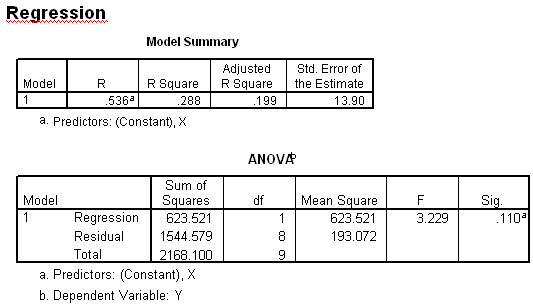

```{r, echo = FALSE, results = "hide"}
include_supplement("item_file_id53_UMCU20020615-8.png", recursive = TRUE)
```
Question
========

Hieronder staat SPSS-uitvoer van een regressieanalyse van Y op X. Hoeveel procent van de variatie in Y kan door X worden verklaard, in deze steekproef?




Answerlist
----------
* 13.9%
* 19.9%
* 28.8%
* 53.6%

Solution
========

The correct answer is  28.8%

Meta-information
================
exname: uva-inferential statistics-410-nl.Rmd
extype: schoice
exsolution: 001
exsection: Inferential Statistics/Regression/Coefficient t-test
exextra[Type]: Calculation, Case, Conceptual, Creating graphs, Data manipulation, Interpretating graph, Interpretating output, Performing analysis, Test choice
exextra[Langauge]: Dutch
exextra[Level]: Statistical Literacy, Statistical Reasoning, Statistical Thinking
