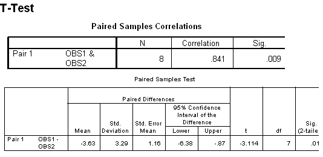

```{r, echo = FALSE, results = "hide"}
include_supplement("item_file_id56_UMCU19990327-8.png", recursive = TRUE)
```
Question
========

Hieronder staat SPSS-uitvoer van een gepaarde T-toets. De significantie van de t-toets is .017. Bepaal met behulp van de tabel wat hier bij tweezijdig toetsen met a = 5% de grenzen van het kritiek gebied zouden zijn: 




Answerlist
----------
* &#177; 1.960
* &#177; 2.3060
* &#177; 2.3646
* &#177; 2.4469

Solution
========

The correct answer is  &#177; 2.3646 

Meta-information
================
exname: uva-inferential statistics-486-nl.Rmd 
extype: schoice 
exsolution: 001 
exsection: Inferential Statistics/Parametric Techniques/t-test/Paired samples
exextra[Type]: Calculation, Case, Conceptual, Creating graphs, Data manipulation, Interpretating graph, Interpretating output, Performing analysis, Test choice 
exextra[Langauge]: Dutch 
exextra[Level]: Statistical Literacy, Statistical Reasoning, Statistical Thinking 
