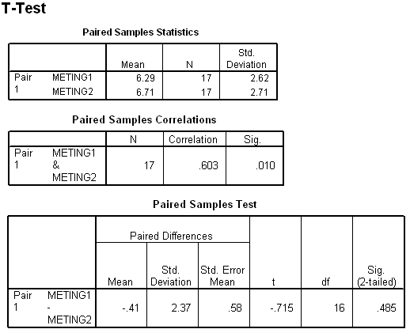

```{r, echo = FALSE, results = "hide"}
include_supplement("item_file_id61_UMCU19990612-6.png", recursive = TRUE)
```
Question
========

Hieronder staat een gedeelte van de SPSS-uitvoer van een gepaarde T-toets op twee metingen aan 17 mensen. Bij toetsing van de nulhypothese dat de twee metingen niet samenhangen moet de conclusie luiden (bij a = 5%, tweezijdig): 




Answerlist
----------
* een significant resultaat, H<sub>0<\/sub> wordt verworpen
* een significant resultaat, H<sub>0<\/sub> wordt niet verworpen
* geen significant resultaat, H<sub>0<\/sub> wordt verworpen
* geen significant resultaat, H<sub>0<\/sub> wordt niet verworpen

Solution
========

The correct answer is  een significant resultaat, H<sub>0<\/sub> wordt verworpen 

Meta-information
================
exname: uva-inferential statistics-506-nl.Rmd 
extype: schoice 
exsolution: 100 
exsection: Inferential Statistics/Parametric Techniques/t-test/Paired samples
exextra[Type]: Calculation, Case, Conceptual, Creating graphs, Data manipulation, Interpretating graph, Interpretating output, Performing analysis, Test choice 
exextra[Langauge]: Dutch 
exextra[Level]: Statistical Literacy, Statistical Reasoning, Statistical Thinking 
