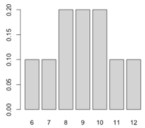

```{r, echo = FALSE, results = "hide"}
include_supplement("UvA20101223-17-1.png", recursive = TRUE)
```
Question
========

Een onderzoeker heeft weinig proefpersonen om twee populaties te vergelijken. Daarom gebruikt zij de Wilcoxon rank sum test voor data met in de ene groep drie en in de andere groep twee proefpersonen. De nulhypothese stelt dat de som van de rangordeningen hetzelfde is voor de twee populaties, en als alternatieve hypothese heeft zij dat de ene populatie lager scoort dan de andere. In een figuur is de exacte kansverdeling weergegeven: Wat is de laagste P-waarde voor de bovenstaande hypotheses die met deze kansverdeling behaald kan worden? 

 

  

Answerlist
----------
* 0.05
* 0.10
* 0.20

Solution
========

The correct answer is  0.10 

Meta-information
================
exname: uva-inferential statistics-77-nl.Rmd 
extype: schoice 
exsolution: 010 
exsection: Inferential Statistics/Non-parametric Techniques/Rank Sum test
exextra[Type]: Calculation, Case, Conceptual, Creating graphs, Data manipulation, Interpretating graph, Interpretating output, Performing analysis, Test choice 
exextra[Langauge]: Dutch 
exextra[Level]: Statistical Literacy, Statistical Reasoning, Statistical Thinking 
