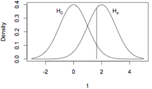

```{r, echo = FALSE, results = "hide"}
include_supplement("UvA20100806-14-1.png", recursive = TRUE)
```
Question
========

Er wordt getoetst op een gemiddelde. De nulhypothese is dat het gemiddelde 0 is en de alternatieve hypothese dat het gemiddelde groter dan 0 is. In de figuur zijn de nulhypothese en een specifieke alternatieve hypothese getekend. De kansen links van de van de verticale lijn onder de alternatieve hypothese en rechts van de verticale lijn onder de nulhypothese zijn respectievelijk 


  

Answerlist
----------
* Power en Type I fout.
* Type II fout en Type I fout.
* Type II fout en power.

Solution
========

The correct answer is  Type II fout en Type I fout. 

Meta-information
================
exname: uva-inferential statistics-94-nl.Rmd 
extype: schoice 
exsolution: 010 
exsection: Inferential Statistics/NHST/Statistical errors
exextra[Type]: Calculation, Case, Conceptual, Creating graphs, Data manipulation, Interpretating graph, Interpretating output, Performing analysis, Test choice 
exextra[Langauge]: Dutch 
exextra[Level]: Statistical Literacy, Statistical Reasoning, Statistical Thinking 
