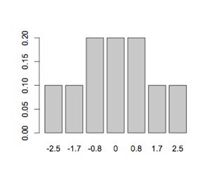

```{r, echo = FALSE, results = "hide"}
include_supplement("UvA20100806-18-1.png", recursive = TRUE)
```
Question
========

In een onderzoek met maar 5 proefpersonen wordt de Wilcoxon test gebruikt om twee groepen te vergelijken. In groep 1 zijn 3 proefpersonen aselect geplaatst en in groep 2 zijn 2 proefpersonen aselect geplaatst. Het verschil in gemiddelde rang wordt gebruikt om de twee groepen te vergelijken. De nulhypothese stelt dat de gemiddelde rangordening gelijk is voor beide groepen, en de alternatieve hypothese dat groep 1 een lagere gemiddelde rangorde heeft dan groep 2. Voor de vergelijking wordt gebruikt: groep 1 - groep 2 (groep 1 minus groep 2). Het verschil in gemiddelde rangordeningen uit de steekproef is -0.8. Gegeven de exacte kansverdeling die hieronder staat afgebeeld, wat is nu de P-waarde?




Answerlist
----------
* 0.1
* 0.2
* 0.4

Solution
========

The correct answer is  0.4

Meta-information
================
exname: uva-inferential statistics-98-nl.Rmd
extype: schoice
exsolution: 001
exsection: Inferential Statistics/Non-parametric Techniques/Signed Rank test
exextra[Type]: Calculation, Case, Conceptual, Creating graphs, Data manipulation, Interpretating graph, Interpretating output, Performing analysis, Test choice
exextra[Langauge]: Dutch
exextra[Level]: Statistical Literacy, Statistical Reasoning, Statistical Thinking
